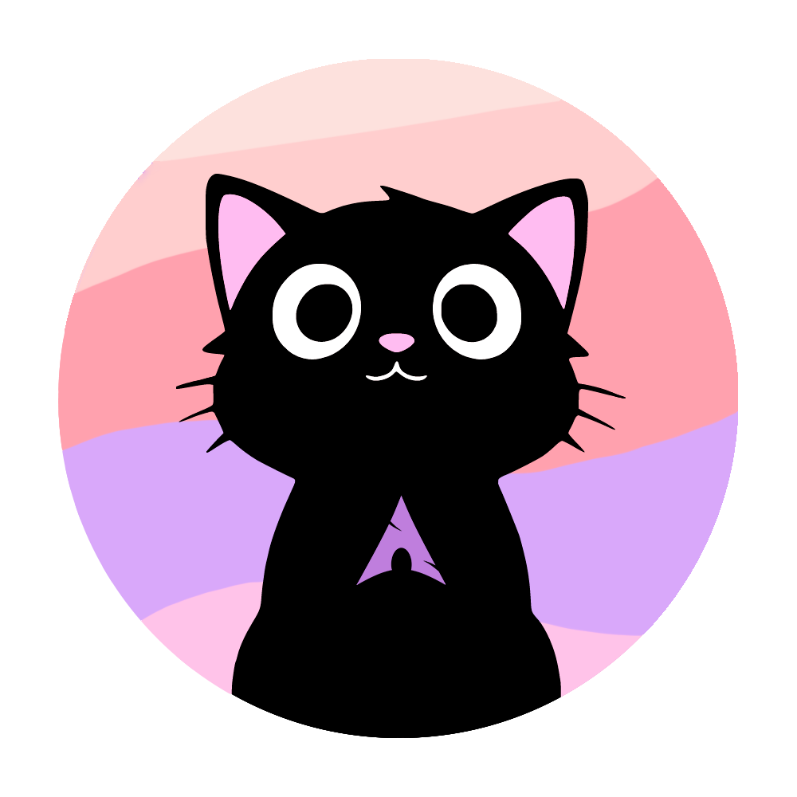

<div align="center">
    
    <h1>🐱 Meowrch NixOS</h1>
    <p><i>A beautiful, declarative, and reproducible NixOS configuration based on <a href="https://github.com/meowrch/meowrch">Meowrch</a></i></p>
    <p>
        <a href="https://github.com/Redm00use/NixOS-Meowrch/stargazers">
            
        </a>
        <a href="https://github.com/Redm00use/NixOS-Meowrch/network/members">
            
        </a>
        <a href="https://nixos.org">
            
        </a>
        <a href="https://t.me/meowrch">
            
        </a>
    </p>
    <p>
        <a href="#-installation">
            
        </a>
        <a href="#-beginner-guide-installing-apps">
            
        </a>
        <a href="./docs/ALIASES.md">
            
        </a>
    </p>
</div>

> [!NOTE]
> A port of the original **[Meowrch](https://github.com/meowrch/meowrch)** (Arch Linux) to **NixOS**.
> Full compatibility with the Nix ecosystem, declarativity, reproducibility, and stability.

## 📑 Table of Contents
- [✨ Features](#-features)
- [📁 Project Structure](#-project-structure)
- [🚀 Installation](#-installation)
- [🔧 Usage & Updates](#-usage--updates)
- [📦 Beginner Guide: Installing Apps](#-beginner-guide-installing-apps)
- [📖 Meowrch Wiki: Customization](#-meowrch-wiki-customization)
- [⌨️ Keybindings & Commands](#️-keybindings--commands)
- [🛠️ Help! I broke something!](#-help-i-broke-something)

---

## ✨ Features

| Feature | Implementation |
|---------|---------------|
| **Window Manager** | Hyprland (Wayland) with UWSM for superior stability |
| **Status Bar** | Mewline (Dynamic Island) — runs as a systemd service |
| **Launcher** | Rofi with custom theme and wallpaper selectors |
| **Session Manager** | UWSM (Universal Wayland Session Manager) |
| **Display Manager** | SDDM with **Qt6** Meowrch theme |
| **Terminal** | Kitty (0.8 opacity) + Fish shell |
| **Shell** | Fish + Starship (minimalist prompt) |
| **Memory** | ZRAM enabled by default |
| **Theming** | Catppuccin Mocha (GTK4 forced dark) |
| **GPU** | Intelligent AMD / Nvidia / Intel support |
| **Editor** | Zed IDE with pre-configured Nix and AI support |

---

## 📁 Project Structure

```text
NixOS-Meowrch/
├── flake.nix                       # Main entry point (Flake)
├── flake.lock                      # Fixed dependency versions
├── hosts/                          # Machine-specific configurations
│   └── meowrch/                    # Host 'meowrch'
│       ├── configuration.nix       # System settings
│       ├── hardware-configuration.nix # Hardware scan result
│       └── home.nix                # User settings (Home Manager)
├── modules/                        # Modular Nix logic
│   ├── nixos/                      # NixOS system modules
│   │   ├── desktop/                # Environment (Hyprland, SDDM, Theming)
│   │   ├── system/                 # Core (Audio, Fonts, Security, Networking)
│   │   └── packages/               # Global packages & Flatpak
│   └── home/                       # Home Manager modules
│       ├── fish.nix                # Shell config
│       ├── starship.nix            # Prompt config
│       ├── hypr-configs/           # Raw Hyprland configs (Binds, Rules)
│       └── ...                     # Rofi, GTK
├── config/                         # Raw application configurations (symlinks)
│   ├── hypr/                       # Hyprland settings
│   ├── kitty/                      # Kitty settings
│   └── ...                         # Fish, Fastfetch, Btop
├── assets/                         # Static system resources
│   ├── sddm/                       # Login screen theme (Qt6)
│   ├── themes/                     # UI Themes (Catppuccin)
│   └── misc/                       # Misc (.face.icon, logos)
├── scripts/                        # Consolidated system scripts
│   ├── rofi-menus/                 # Rofi scripts (Power, VPN, Wallpaper)
│   └── ...                         # Utilities (volume, backlight, update)
├── pkgs/                           # Custom package definitions (Derivations)
├── packages/                       # Nix derivations for local folders
├── overlays/                       # System patches (GBM fix, etc.)
└── docs/                           # Documentation and log archives
```

---

## 🚀 Installation

### 1. Preparation (Important!)
Before you begin, ensure you have NixOS installed. You will need **Git** to clone this repository:
```bash
# Temporarily install git
nix-shell -p git
```

> [!CAUTION]
> **IMPORTANT:** Do NOT delete or move the repository folder (`~/NixOS-Meowrch`) after installation! In NixOS, this folder is the source code of your system.

### 2. Installation

```bash
git clone https://github.com/Redm00use/NixOS-Meowrch.git
cd NixOS-Meowrch
chmod +x install.sh
./install.sh
```

---

## 🔧 Usage & Updates

Convenient short commands are available (aliases):

| Alias | Desc | Description |
|-------|------|-------------|
| `u`     | `г`  | **Full Update**: git pull + update hashes + flake update + rebuild |
| `b`     | `и`  | **Fast Rebuild**: apply current config changes |
| `clean` | -    | **Cleanup**: remove old generations and collect garbage |
| `rollback`| -  | **Rollback**: return to previous successful state |

---

## 📦 Beginner Guide: Installing Apps

In NixOS, you don't install packages via `apt install`. You declare them in lists.

### 1. Personal Apps (Browsers, Players, Games)
Open `hosts/meowrch/home.nix` (command `zed ~/NixOS-Meowrch/hosts/meowrch/home.nix`).
Find the `home.packages` section and add the app name:
```nix
home.packages = with pkgs; [
  telegram-desktop
  vlc
  discord
];
```

### 2. System Tools (Drivers, Utilities)
Open `modules/nixos/packages/packages.nix` and add packages to `environment.systemPackages`.

**How to find the package name?**
Visit **[search.nixos.org](https://search.nixos.org/packages)**. 

**How to apply?**
Just type in the terminal: `b`

---

## 📖 Meowrch Wiki: Customization

Learn how to tweak the look and feel of your Meowrch system.

### 🖼️ UI Management (Hyprland)
Main configuration files are located in `modules/home/hypr-configs/`.

*   **Keybindings**: Edit `keybindings.conf`. Change defaults or add your own shortcuts.
*   **Window Rules**: In `windowrules.conf`, you can force apps to open on specific workspaces or set their opacity.
*   **Animations**: The `appearance.conf` file contains `animations` settings. Make your system lightning fast or buttery smooth.
*   **Monitors**: Configure resolution, refresh rates, and position in `monitors.conf`.

### 🎨 Themes, Wallpapers & Fonts
*   **Wallpapers**: To add your own images to the wallpaper menu (`Super + W`), drop them into `assets/wallpapers/`.
*   **Theming**: The system uses **Catppuccin Mocha**. To tweak terminal or bar colors, look into `assets/themes/`.
*   **Fonts**: Change the primary system font in `modules/nixos/system/fonts.nix`.

### 📝 Zed Editor (Your Main Tool)
**Zed IDE** comes pre-configured for the best experience:
*   Full Nix support (syntax highlighting, auto-formatting).
*   Built-in Git integration: see your changes in real-time.
*   Handy shortcuts like `Ctrl + /` for comments.

---

## 🛠️ Help! I broke something!

In NixOS, it is **impossible** to permanently "kill" your system via software!

1.  **If it won't boot**: Reboot and select a previous "Generation" from the boot menu.
2.  **If it's buggy**: Run the command `rollback` in your terminal.
3.  **Build Error (`b`)**: Read the error message carefully. Nix usually tells you exactly which file and line caused the issue.

---

## ⌨️ Keybindings & Commands

| Key | Action |
|-----|--------|
| `Super + Return` | Terminal (Kitty + Fish) |
| `Super + Q` | Close window |
| `Super + E` | File Manager (Nemo) |
| `Super + D` | App Launcher (Rofi) |
| `Super + Z` | Browser (Firefox) |
| `Super + T` | Telegram (Materialgram) |
| `Super + W` | Select Wallpaper |
| `Super + Shift + T` | Select Theme |
| `Super + X` | Power Menu |
| `Super + L` | Lock Screen |
| `Super + Shift + B` | Toggle Status Bar |

---
<div align="center">
    <p><i>Made with ❤️ for the NixOS and Meowrch community</i></p>
    <p><sub>≽ܫ≼</sub></p>
</div>
