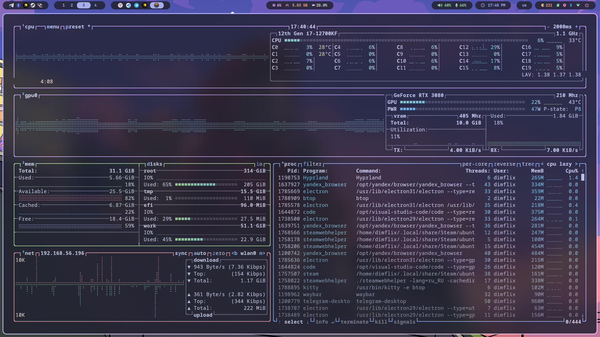

<div align="center">
	
	<h1> Meowrch NixOS ≽ܫ≼</h1>
	<a href="https://github.com/Redm00us/meowrch-nixos/issues">
		
	</a>
	<a href="https://github.com/Redm00us/meowrch-nixos/stargazers">
		
	</a>
	<a href="./LICENSE">
		
	</a>
	<br>
	<br>
	<a href="./README.md">
		
	</a>
	<a href="./README.en.md">
		
	</a>
	<br>
	<br>
	<a href="./ALIASES.md">
		
	</a>
</div>

***

<!-- INFORMATION -->
<table align="right">
	<tr>
	    <td colspan="2" align="center">System Parameters</td>
	</tr>
	<tr>
	    <th>Component</th>
	    <th>Name</th>
	</tr>
	<tr>
	    <td>OS</td>
	    <td><a href="https://nixos.org/">NixOS 25.05</a></td>
	</tr>
	<tr>
	    <td>WM</td>
	    <td><a href="https://hyprland.org/">Hyprland</a></td>
	</tr>
	<tr>
	    <td>Bar</td>
	    <td><a href="https://github.com/Alexays/Waybar">Waybar</a></td>
	</tr>
	<tr>
	    <td>Compositor</td>
	    <td>Built-in</td>
	</tr>
	<tr>
	    <td>Bootloader</td>
	    <td><a href="https://www.freedesktop.org/wiki/Software/systemd/systemd-boot/">systemd-boot</a></td>
	</tr>
	<tr>
	    <td>Terminal</td>
	    <td><a href="https://github.com/kovidgoyal/kitty">Kitty</a></td>
	</tr>
	<tr>
	    <td>App Launcher</td>
	    <td><a href="https://github.com/davatorium/rofi">Rofi</a></td>
	</tr>
	<tr>
	    <td>Notify Daemon</td>
	    <td><a href="https://github.com/dunst-project/dunst">Dunst</a></td>
	</tr>
	<tr>
	    <td>Shell</td>
	    <td><a href="https://github.com/fish-shell/fish-shell">Fish</a></td>
	</tr>
	<tr>
	    <td>Audio</td>
	    <td><a href="https://pipewire.org/">PipeWire</a></td>
	</tr>
	<tr>
	    <td>Theme</td>
	    <td><a href="https://catppuccin.com/">Catppuccin</a></td>
	</tr>
	<tr>
	    <td>📋 Aliases</td>
	    <td><a href="./ALIASES.md">150+ commands</a></td>
	</tr>
</table>
<div align="left">
	<h3> 📝 About the project</h2> 
	<p>
	Meowrch NixOS is a beautiful and optimized NixOS 25.05 configuration inspired by the original Meowrch Arch Linux rice. Built with reproducibility and performance in mind, featuring Hyprland with modern tools and stunning aesthetics.
	</p>
	<h3>🚀 Features</h2>
	<p>
	• Complete NixOS configuration with Hyprland Wayland compositor<br>
	• Beautiful Catppuccin theming across the entire system<br>
	• Optimized for AMD graphics with gaming support (Steam, Flatpak)<br>
	• Reproducible builds with Nix flakes and Home Manager<br>
	• Custom keybindings designed for maximum productivity<br>
	• Modern audio system with PipeWire and Bluetooth support<br>
	• Automatic installation script with interactive setup<br>
	• Fish shell with custom aliases and Starship prompt<br>
	</p>
</div>

> [!WARNING]
> THIS CONFIGURATION IS OPTIMIZED FOR AMD GRAPHICS CARDS.
> NVIDIA USERS MAY NEED TO MAKE MANUAL ADJUSTMENTS.
> PLEASE REPORT ANY ISSUES YOU ENCOUNTER.

<!-- IMAGES -->
<table align="center">
  <tr>
    <td colspan="4"></td>
  </tr>
  <tr>
    <td colspan="1"></td>
    <td colspan="1"></td>
    <td colspan="1"></td>
  </tr>
  <tr>
	<td colspan="1"></td>
	<td colspan="1"></td>
	<td colspan="1"></td>
  </tr>
</table>

## 🆕 What's New in Version 2.0!

### 🎯 Universal Installer
**No more hardcoded usernames!**

🔄 **Works with any username** - system automatically configures for you  
🎛️ **Interactive menu** - choose exactly what to install  
✨ **Smart configuration** - asks for your details and updates everything  
🛡️ **Safe and secure** - creates backups before making changes  
⚡ **Quick user switching** - change username after installation  

### 🎮 What this means for you?
- **Simply run** `./install.sh` and follow the prompts
- **System will ask** for your name, email, and other details  
- **Everything configures automatically** - Git, aliases, file paths
- **Easy to share** configuration with other people
- **One command** to change user: `./change-user.sh`

<!-- INSTALLATION -->
### 🎯 New! Universal Installer
**Now works with any username!**
- 🔄 **Automatic configuration** of your username
- ✨ **Simple interactive installer** with menu
- 🎛️ **Choose what to install** - everything at once or step by step
- 🛡️ **Safe** - creates backups

### If you already have NixOS installed:
### 1. Clone the repository
```bash
git clone https://github.com/Redm00us/meowrch-nixos.git
cd meowrch-nixos
```
### 2. Run the smart installer
```bash
chmod +x install.sh
./install.sh
```

**The installer will do everything else!**
- Ask for your username and details
- Configure the system for you
- Check for errors
- Install everything needed

> [!important]
> After installation, you **must** reboot to apply all changes.

> [!note]
> Instructions for navigating the installer menu:
> - Select menu item: Press Spacebar to select the desired item
> - Advance to next step: Press Enter to proceed to the next step

### 🔧 What can the installer do?

**The installer will show you a menu with options:**

1. **🚀 Full Installation** *(recommended for beginners)*
   - Configure your username
   - Auto-detect your hardware  
   - Check everything for errors
   - Install the complete system

2. **⚙️ Configure User Only**
   - Change username if needed
   - Update email and other details

3. **🔧 Generate Hardware Config**
   - Detect your disks and devices
   - Only needed once

4. **✅ Validate Configuration**
   - Find errors before installation
   - Show what needs fixing

5. **📦 Build System Only**
   - Apply changes without other setup

6. **🏠 Setup User Environment**
   - Configure your desktop and programs

### 🎮 Quick User Change

If you already installed the system but want to change username:

```bash
# Interactive mode (with questions)
./change-user.sh

# Quick command mode
./change-user.sh -u newname -n "Your Name" -e "email@example.com"
```

### 🤓 For Advanced Users
```bash
# Build system directly
sudo nixos-rebuild switch --flake .#meowrch

# Apply user settings  
home-manager switch --flake .#your_username

# Reboot system
sudo reboot
```

<h2>💻 Help & Support</h2>
If you have questions or need help with the project, please visit our <a href="https://github.com/Redm00use/meowrch-nixos/issues">Issues</a> section.<br><br>
You can also check the original <a href="https://github.com/meowrch/meowrch">Meowrch project</a> for additional inspiration and themes.<br><br>
For quick support and discussions, join our <a href="https://t.me/meowrch">Telegram channel</a> or contact directly on Telegram <a href="https://t.me/Redm00us">@Redm00us</a>.<br><br>
For NixOS-specific questions, refer to the <a href="https://nixos.org/manual/nixos/stable/">NixOS Manual</a> and <a href="https://nix-community.github.io/home-manager/">Home Manager documentation</a>.<br><br>
Your feedback helps us improve the project and make it even more convenient for users.

<h2>💻 Hotkeys</h2>
<table align="center">
	<tr>
		<td colspan="2" align="center">Key combinations</td>
	</tr>
    <tr>
        <th>Action</th>
        <th>Hyprland</th>
    </tr>
	<tr>
        <td>Open terminal</td>
		<td align="center">super + enter</td>
    </tr>
    <tr>
        <td>Open application menu</td>
		<td align="center">super + d</td>
    </tr>
	<tr>
        <td>Open file manager</td>
		<td align="center">super + e</td>
    </tr>
	<tr>
        <td>Open Firefox</td>
		<td align="center">super + shift + f</td>
    </tr>
	<tr>
        <td>Open task manager (btop)</td>
		<td align="center">ctrl + shift + esc</td>
    </tr>
	<tr>
        <td>Open emoji picker</td>
		<td align="center">super + .</td>
    </tr>
    <tr>
        <td>Open power menu</td>
		<td align="center">super + x</td>
    </tr>
	<tr>
        <td>Take screenshot</td>
		<td align="center">PrintScreen</td>
    </tr>
	<tr>
        <td>Change wallpaper</td>
		<td align="center">super + w</td>
    </tr>
	<tr>
        <td>Change theme</td>
		<td align="center">super + t</td>
    </tr>
	<tr>
        <td>Change keyboard layout</td>
		<td align="center">shift + alt</td>
    </tr>
    <tr>
        <td>Color picker</td>
		<td align="center">super + c</td>
    </tr>
    <tr>
        <td>Lock screen</td>
        <td align="center">super + l</td>
    </tr>
	<tr>
        <td>Switch workspace</td>
		<td align="center">super + 1-10</td>
    </tr>
    <tr>
        <td>Move window to workspace</td>
		<td align="center">super + shift + 1-10</td>
    </tr>
    <tr>
        <td>Toggle floating mode</td>
		<td align="center">super + space</td>
    </tr>
	<tr>
        <td>Toggle fullscreen</td>
		<td align="center">alt + enter</td>
    </tr>
    <tr>
        <td>Close window</td>
		<td align="center">super + q</td>
    </tr>
    <tr>
        <td>Restart window manager</td>
		<td align="center">ctrl + shift + r</td>
    </tr>
	<tr>
		<td>Full configuration in:</td>
		<td>home/modules/hyprland.nix</td>
	</tr>
</table>

## 📋 Quick Commands & Aliases

The system includes over **150 convenient aliases** for NixOS management:

```bash
b           # Quick system rebuild
u           # Update and rebuild
validate    # Check configuration
c           # Open config in editor
cleanup     # Clean system
```

🔗 **[Complete Aliases & Functions Reference →](./ALIASES.md)**

## 🎨 Customization

### Adding Packages
Edit `configuration.nix` for system packages:
```nix
environment.systemPackages = with pkgs; [
  # Add your packages here
  neofetch
  discord
];
```

Edit `home/home.nix` for user packages:
```nix
home.packages = with pkgs; [
  # Add user packages here
  spotify
  gimp
];
```

### Theme Management
```bash
# Switch between Catppuccin variants
theme-switch mocha    # Dark theme
theme-switch latte    # Light theme

# Apply changes
sudo nixos-rebuild switch --flake .#meowrch
```

### Custom Keybindings
Edit `home/modules/hyprland.nix`:
```nix
bind = [
  "$mainMod, Y, exec, your-custom-command"
  # Add more bindings here
];
```

## 🔧 Troubleshooting

### Common Issues
```bash
# Clear Nix store
sudo nix-collect-garbage -d

# Rebuild system
sudo nixos-rebuild switch --flake .#meowrch

# Check system logs
journalctl -xe

# Check Hyprland logs
journalctl --user -u hyprland
```

### Audio Issues
```bash
# Restart PipeWire
systemctl --user restart pipewire pipewire-pulse wireplumber
```

### Graphics Issues
```bash
# Check AMD GPU status
lspci | grep VGA
glxinfo | grep vendor
```

## 🔄 Updates

### Update System
```bash
# Update flake inputs
nix flake update

# Rebuild system
sudo nixos-rebuild switch --flake .#meowrch

# Update Home Manager
home-manager switch --flake .#redm00us
```

## 🤝 Contributing

We welcome contributions! Here's how you can help:

1. **🐛 Report bugs** - Open issues with detailed information
2. **💡 Suggest features** - Share ideas for improvements  
3. **🔧 Submit fixes** - Fork, fix, and create pull requests
4. **📚 Improve docs** - Help make documentation better
5. **🎨 Create themes** - Design new color schemes

### Development Setup
```bash
git clone https://github.com/Redm00us/meowrch-nixos.git
cd meowrch-nixos
nix develop
```

## 📚 Resources

- **🏠 [NixOS Manual](https://nixos.org/manual/nixos/stable/)** - Official documentation
- **❄️ [Nix Pills](https://nixos.org/guides/nix-pills/)** - Learn Nix language
- **🏡 [Home Manager](https://nix-community.github.io/home-manager/)** - User configuration
- **🪟 [Hyprland Wiki](https://wiki.hyprland.org/)** - Wayland compositor guide
- **🎨 [Catppuccin](https://catppuccin.com/)** - Theme collection
- **🐱 [Original Meowrch](https://github.com/meowrch/meowrch)** - Arch Linux inspiration

## ☕ Support project
If you would like to support the original Meowrch project, you can donate to their cryptocurrency wallets:

| CryptoCurrency | Address                                        |
| ------------ | -------------------------------------------------- |
| **TON**      | `UQB9qNTcAazAbFoeobeDPMML9MG73DUCAFTpVanQnLk3BHg3` |
| **Ethereum** | `0x56e8bf8Ec07b6F2d6aEdA7Bd8814DB5A72164b13`       |
| **Bitcoin**  | `bc1qt5urnw7esunf0v7e9az0jhatxrdd0smem98gdn`       |
| **Tron**     | `TBTZ5RRMfGQQ8Vpf8i5N8DZhNxSum2rzAs`               |

## 📊 Star History
<a href="https://star-history.com/#Redm00us/meowrch-nixos&Date">
 <picture>
   <source media="(prefers-color-scheme: dark)" srcset="https://api.star-history.com/svg?repos=Redm00us/meowrch-nixos&type=Date&theme=dark" />
   <source media="(prefers-color-scheme: light)" srcset="https://api.star-history.com/svg?repos=Redm00us/meowrch-nixos&type=Date" />
   
 </picture>
</a>

---

<div align="center">
<p><strong>Made with 💜 by the Meowrch community</strong></p>
<p><em>NixOS port inspired by the original <a href="https://github.com/meowrch/meowrch">Meowrch</a> Arch Linux rice</em></p>
</div>
