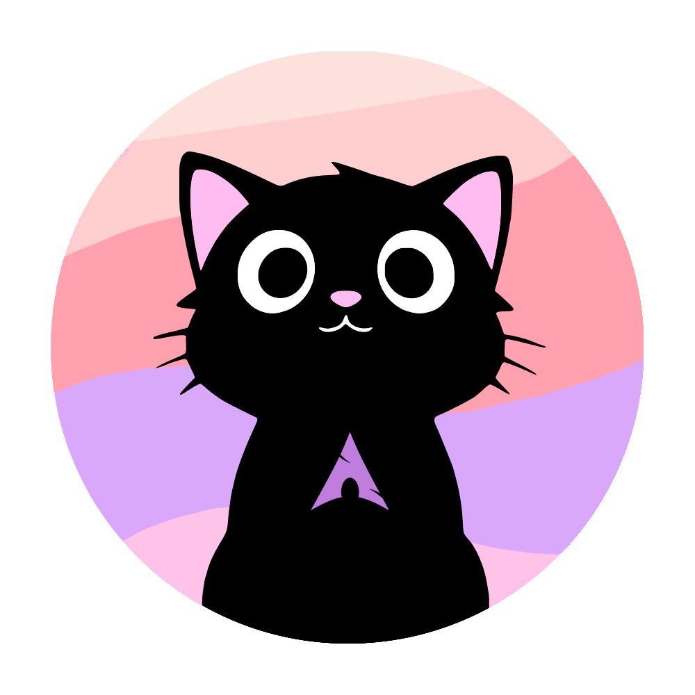
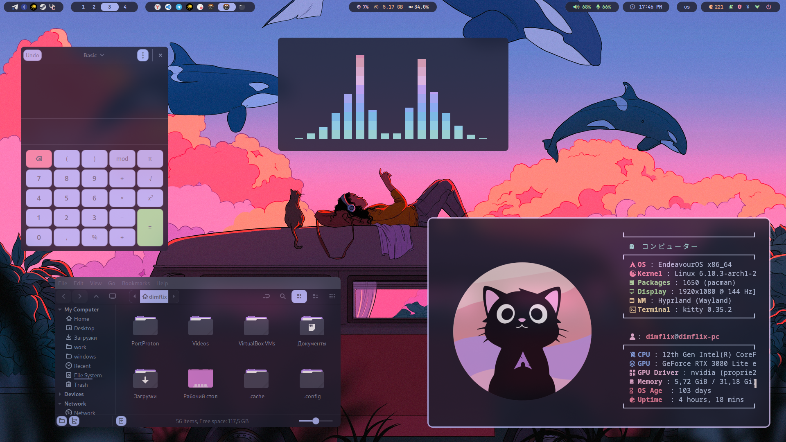
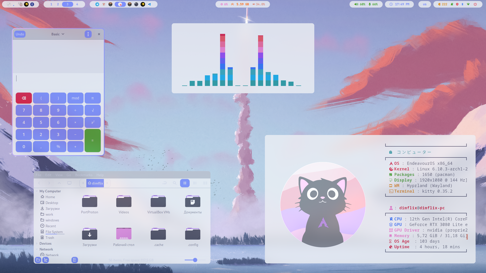
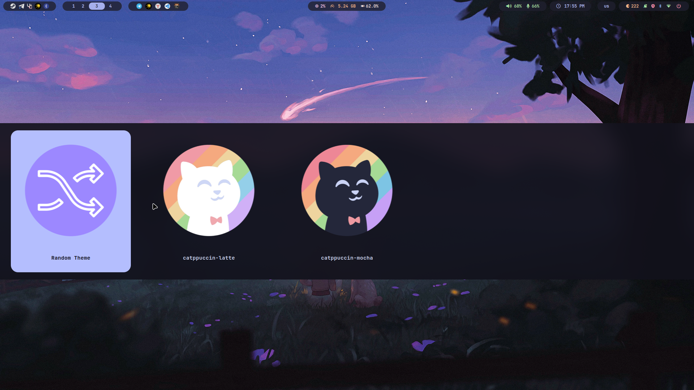

<div align="center">
	
	<h1> Meowrch NixOS ≽ܫ≼</h1>
	<a href="https://github.com/Redm00use/NixOS-Meowrch/issues">
		
	</a>
	<a href="https://github.com/Redm00use/NixOS-Meowrch/stargazers">
		
	</a>
	<a href="./LICENSE">
		
	</a>
	<br>
	<br>
	<a href="./README.md">
		
	</a>
	<a href="./README.en.md">
		
	</a>
	<br>
	<br>
	<a href="./ALIASES.md">
		
	</a>
</div>

<div align="center">
  <div style="max-width:880px;margin:0 auto;">
    <div style="background:#2a0d10;border:2px solid #ff4d4f;border-radius:14px;padding:16px 22px;text-align:left;font-family:Segoe UI,system-ui,sans-serif;">
      <div style="font-weight:700;font-size:16px;letter-spacing:.5px;color:#ff6b6b;display:flex;align-items:center;gap:8px;">
        <span style="font-size:20px;">🚨</span> ВАЖНО: ТОЛЬКО AMD GPU СЕЙЧАС
      </div>
      <div style="margin-top:10px;line-height:1.45;font-size:14.5px;color:#ffd9d9;">
        Проект оптимизирован и протестирован для <strong>AMD (RADV / AMDVLK)</strong>.  
        Поддержка NVIDIA в разработке. 
      </div>
    </div>
  </div>
</div>

***

<table align="right">
	<tr><td colspan="2" align="center">Системные параметры</td></tr>
	<tr><th>Компонент</th><th>Название</th></tr>
	<tr><td>OS</td><td><a href="https://nixos.org/">NixOS 25.05</a></td></tr>
	<tr><td>WM</td><td><a href="https://hyprland.org/">Hyprland</a></td></tr>
	<tr><td>Bar</td><td><a href="https://github.com/Alexays/Waybar">Waybar</a></td></tr>
	<tr><td>Terminal</td><td><a href="https://github.com/kovidgoyal/kitty">Kitty</a></td></tr>
	<tr><td>App Launcher</td><td><a href="https://github.com/davatorium/rofi">Rofi</a></td></tr>
	<tr><td>Shell</td><td><a href="https://github.com/fish-shell/fish-shell">Fish</a></td></tr>
	<tr><td>Audio</td><td><a href="https://pipewire.org/">PipeWire</a></td></tr>
	<tr><td>Theme</td><td><a href="https://catppuccin.com/">Catppuccin</a></td></tr>
</table>

### 📝 О проекте
**Meowrch NixOS** — красивая и оптимизированная конфигурация NixOS (Hyprland + Catppuccin).  
**Особенности:**
• Воспроизводимая сборка (Flakes + Home Manager)  
• Готовая игровая среда (Steam, Flatpak)  
• Автоматическая установка через скрипт  

<!-- IMAGES -->
<table align="center">
  <tr><td colspan="4"></td></tr>
  <tr>
    <td colspan="1"></td>
    <td colspan="1"></td>
    <td colspan="1"></td>
  </tr>
</table>

## 🛠 Установка

Установка максимально упрощена. Скрипт сам настроит имя пользователя, определит железо и соберёт систему.

### 1. Клонируем репозиторий
```bash
git clone https://github.com/Redm00use/NixOS-Meowrch.git
cd NixOS-Meowrch
```

### 2. Запускаем установщик
```bash
chmod +x install.sh
./install.sh
```

**Следуйте инструкциям на экране.**  
Скрипт предложит:
- Полную установку (рекомендуется)
- Генерацию конфига железа
- Просто сборку системы

> [!IMPORTANT]
> После завершения установки перезагрузите компьютер.

## 💻 Горячие клавиши (Основные)

| Действие | Сочетание |
|---|---|
| Терминал | `Solid + Enter` |
| Меню приложений | `Super + D` |
| Файлы | `Super + E` |
| Браузер | `Super + Shift + F` |
| Закрыть окно | `Super + Q` |
| Сменить обои | `Super + W` |
| Сменить тему | `Super + T` |

*Полный список см. в коде или справке.*

## 🤝 Поддержка и ссылки

- **[Telegram канал](https://t.me/meowrch)** / **[Чат](https://t.me/Redm00us)**
- **[Issues](https://github.com/Redm00use/NixOS-Meowrch/issues)** — ошибки и предложения
- **[NixOS Manual](https://nixos.org/manual/nixos/stable/)**

<div align="center">
<p><strong>Сделано с 💜</strong></p>
</div>
